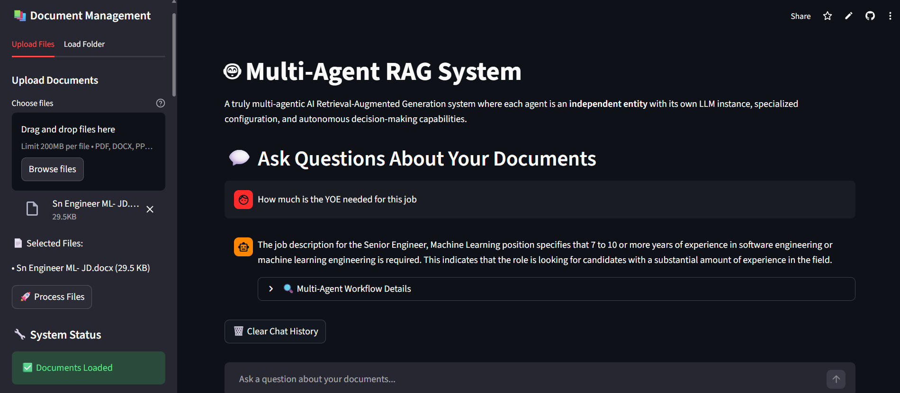

# 🤖 Multi-Agent RAG System



A multi-agentic Retrieval-Augmented Generation system where each agent is an independent entity with its own LLM instance and specialized configuration.

## 🛠️ Tech Stack
- **Python 3.8+**
- **LangChain** - LLM framework  
- **LangGraph** - Multi-agent workflow orchestration
- **FAISS** - Vector similarity search
- **Streamlit** - Web interface

## 🚀 Installation

1. **Install dependencies**
```bash
pip install -r requirements.txt
```

2. **Environment setup**
```bash
# Create .env file
OPENAI_API_KEY=your-openai-api-key-here
```

3. **Run application**
```bash
streamlit run app.py
```

## 🏗️ Architecture


### Multi-Agent System
Eight independent agents with specialized roles:

| Agent | Model | Role |
|-------|-------|------|
| SecurityGuard | GPT-4o | Input validation & threat detection |
| QueryOptimizer | GPT-4o | Query enhancement & optimization |
| DocumentRetriever | GPT-3.5 | Vector search & document retrieval |
| AnswerGenerator | GPT-4o | Answer synthesis & reasoning |
| GroundingValidator | GPT-4o | Fact-checking & validation |
| QualityEvaluator | GPT-4o | Quality assessment & refinement |
| OutputGuard | GPT-4o | Safety validation |
| MemoryManager | GPT-3.5 | Conversation history management |

### Workflow
```
User Query → Security Check → Query Optimization → Document Retrieval → 
Answer Generation → Grounding Validation → Quality Evaluation → 
Output Safety → Memory Management
```

### Context Management
- **Chat History**: Last 8 conversations 
- **Document Retrieval**: Top 5 relevant chunks
- **Token Limits**: Smart truncation with sentence boundary preservation
- **Memory**: Max 30 conversation items with intelligent pruning

## ✨ Features

### Core Capabilities
- **Multi-Agent Architecture**: 8 independent agents with specialized roles
- **Iterative Refinement**: Automatic query optimization (max 2 iterations)
- **Inter-Agent Communication**: Real-time message passing between agents
- **Performance Monitoring**: Live metrics and transparency

### Multimodal RAG
- **CLIP Embeddings**: Fast local image processing (~50-200ms per image)
- **GPT-4 Vision**: Optional detailed image captions
- **Table Extraction**: Complete raw table data preservation
- **Document Support**: PDF, DOCX, PPTX, XLSX, TXT

### Context Intelligence
- **Recursive Text Splitting**: Smart document chunking (1000 chars, 200 overlap)
- **Follow-up Detection**: Conversation context awareness
- **Memory Management**: Intelligent history pruning