# 🤖 Agentic RAG System

A sophisticated collaborative AI Retrieval-Augmented Generation system with Streamlit interface. Upload documents and ask questions - the system processes your queries through 8 specialized AI agents for intelligent, accurate responses.

## 🌟 Features

- **Orchestrated AI Architecture**: 8 AI agents working together (input validation, query optimization, document retrieval, answer generation, quality evaluation, safety checks)
- **Iterative Refinement**: System automatically improves answers through self-evaluation (up to 2 iterations)
- **Multiple Document Types**: PDF, DOCX, PPTX, TXT, XLSX support
- **FAISS Vector Search**: High-performance semantic similarity matching
- **Safety Controls**: Input/output filtering and content validation
- **Web Interface**: Easy-to-use Streamlit interface with chat functionality

## 🚀 Quick Start

### 1. Install Dependencies
```bash
pip install -r requirements.txt
```

### 2. Set OpenAI API Key

#### For Local Development:
Create a `.env` file in the project root:
```bash
OPENAI_API_KEY=your-openai-api-key-here
```

#### For Streamlit Cloud Deployment:
1. Go to your Streamlit Cloud app dashboard
2. Click on your app settings 
3. Navigate to "Secrets" section
4. Add the following:
```toml
OPENAI_API_KEY = "your-openai-api-key-here"
```

*Get your API key from: https://platform.openai.com/api-keys*

### 3. Run the Application

#### Locally:
```bash
streamlit run app.py
```

#### Deploy to Streamlit Cloud:
1. Push your code to GitHub
2. Go to [share.streamlit.io](https://share.streamlit.io)
3. Connect your GitHub repository
4. Set the main file as `app.py`
5. Add your OpenAI API key to secrets (as shown above)

The app will open at `http://localhost:8501` (local) or your Streamlit Cloud URL

## 📖 How to Use

1. **Upload Documents**: Use the sidebar to upload files or load from a folder
2. **Wait for Processing**: The system builds a vector database from your documents
3. **Ask Questions**: Type questions about your documents in the chat
4. **Get Smart Answers**: The system processes through all agents and may refine answers automatically

## 📁 Architecture Overview

### 🔄 Workflow Diagram

```mermaid
graph TD
    A[User Query] --> B[Input Guard Agent]
    B --> C{Query Safe?}
    C -->|Yes| D[Query Rewriter Agent]
    C -->|No| E[❌ Rejected Query]
    
    D --> F[Document Retriever Agent]
    F --> G[Vector Store Search]
    G --> H[Retrieved Documents]
    
    H --> I[Answer Generator Agent]
    I --> J[Generated Answer]
    
    J --> K[Grounding Check Agent]
    K --> L{Answer Grounded?}
    L -->|Yes| M[Answer Evaluator Agent]
    L -->|No| N[❌ Ungrounded Answer]
    
    M --> O{Good Quality?}
    O -->|Yes| P[Output Guard Agent]
    O -->|No| Q{Max Iterations?}
    
    Q -->|No| R[Refine Query]
    R --> D
    Q -->|Yes| S[❌ Max Attempts Reached]
    
    P --> T{Output Safe?}
    T -->|Yes| U[Memory Manager Agent]
    T -->|No| V[❌ Unsafe Output]
    
    U --> W[Update Conversation History]
    W --> X[✅ Final Answer to User]
    
    style A fill:#e1f5fe
    style X fill:#c8e6c9
    style E fill:#ffcdd2
    style N fill:#ffcdd2
    style S fill:#ffcdd2
    style V fill:#ffcdd2
```



**Core Components:**
- **Streamlit Interface**: Web-based user interface for document upload and chat
- **Agent System**: Eight specialized AI agents for different processing tasks
- **Workflow Orchestration**: LangGraph coordinates agent execution and decision flow
- **Document Processing**: Multi-format document loading and text chunking
- **Vector Database**: FAISS-powered semantic search and retrieval
- **Configuration Management**: Centralized settings and environment handling

## ⚙️ Configuration

Edit `config.py` to customize:
- **Models**: Change OpenAI models (default: GPT-4o, text-embedding-3-large)
- **Chunk Size**: Document splitting parameters (default: 1000 chars)
- **Retrieval**: Number of documents to retrieve (default: 5)
- **Iterations**: Max refinement loops (default: 2)

## 🛠️ Requirements

- Python 3.8+
- OpenAI API key
- Internet connection (for OpenAI API calls)

## 🐛 Troubleshooting

**API Key Issues**: 
- Ensure OpenAI API key is properly configured in environment variables or Streamlit secrets
- For Streamlit Cloud: Add `OPENAI_API_KEY` to app secrets (not environment variables)
- Verify your API key has sufficient credits and permissions

**Embedding Errors ('NoneType' object has no attribute 'embed_documents')**:
- This indicates the OpenAI API key is not loaded properly
- Check that your API key is added to Streamlit Cloud secrets
- Ensure the key doesn't start with "your-" (placeholder text)

**Dependency Issues**: 
- Verify all required packages are installed correctly
- For cloud deployment, ensure `requirements.txt` is in the root directory

**Document Loading Problems**: 
- Check that file formats are supported and files are accessible
- Verify uploaded files are not corrupted

**Performance Issues**: 
- Large documents may require longer processing time for vector database creation
- Consider splitting very large documents into smaller sections

## 📋 Example Questions

- "What is the main topic of these documents?"
- "Summarize the key requirements"
- "How do I apply for this position?" 
- "What are the important dates mentioned?"

## 🔄 How It Works

The system processes your questions through 8 AI agents:

1. **Input Guard** - Validates query safety
2. **Query Rewriter** - Optimizes for better retrieval
3. **Document Retriever** - Finds relevant content using FAISS
4. **Answer Generator** - Creates responses based on context
5. **Grounding Check** - Validates accuracy against sources
6. **Answer Evaluator** - Assesses quality and triggers refinement if needed
7. **Output Guard** - Final safety validation
8. **Memory Manager** - Updates conversation history

If the answer needs improvement, the system automatically refines the query and tries again (up to 2 iterations).

## 📄 License

This project is open source under the MIT License.

---

**Ready to experience intelligent document Q&A with autonomous AI agents!** 🚀