# 🤖 Multi-Agent RAG System

A truly multi-agentic AI Retrieval-Augmented Generation system where each agent is an independent entity with its own LLM instance, specialized configuration, and autonomous decision-making capabilities.

## 🚀 Quick Start

### Installation
```bash
pip install -r requirements.txt
```

### Configuration
Create a `.env` file:
```bash
OPENAI_API_KEY=your-openai-api-key-here
```

### Run
```bash
streamlit run app.py
```


## 🏗️ Architecture

### Multi-Agent System
Eight independent agents, each with dedicated LLM instance and specialized configuration:

| Agent | Model | Temperature | Role |
|-------|-------|-------------|------|
| **SecurityGuard** | GPT-4o | 0.1 | Threat detection & input validation |
| **QueryOptimizer** | GPT-4o | 0.4 | NLP-based query optimization |
| **DocumentRetriever** | GPT-3.5-turbo | 0.0 | Vector similarity search |
| **AnswerGenerator** | GPT-4o | 0.3 | Deep reasoning & answer synthesis |
| **GroundingValidator** | GPT-4o | 0.1 | Fact-checking & validation |
| **QualityEvaluator** | GPT-4o | 0.2 | Metacognitive quality assessment |
| **OutputGuard** | GPT-4o | 0.1 | Safety validation & filtering |
| **MemoryManager** | GPT-3.5-turbo | 0.0 | Conversation history management |

### Workflow Diagram

```mermaid
graph TD
    Start([User Query]) --> A[SecurityGuard Agent<br/>GPT-4o T=0.1]
    A -->|Safe| B[QueryOptimizer Agent<br/>GPT-4o T=0.4]
    A -->|Threat| Reject([❌ Query Blocked])
    
    B --> C[DocumentRetriever Agent<br/>GPT-3.5 T=0.0]
    C -->|FAISS Search| D[(Vector Store)]
    D --> E[AnswerGenerator Agent<br/>GPT-4o T=0.3]
    
    E --> F[GroundingValidator Agent<br/>GPT-4o T=0.1]
    F -->|Validated| G[QualityEvaluator Agent<br/>GPT-4o T=0.2]
    F -->|Invalid| Reject2([❌ Ungrounded Answer])
    
    G -->|Quality OK| H[OutputGuard Agent<br/>GPT-4o T=0.1]
    G -->|Needs Refinement| I{Iterations < 2?}
    
    I -->|Yes| B
    I -->|No| H
    
    H -->|Safe| J[MemoryManager Agent<br/>GPT-3.5 T=0.0]
    H -->|Unsafe| Reject3([❌ Output Blocked])
    
    J --> End([✅ Response to User])
    
    style Start fill:#e3f2fd
    style End fill:#c8e6c9
    style Reject fill:#ffcdd2
    style Reject2 fill:#ffcdd2
    style Reject3 fill:#ffcdd2
    style D fill:#fff9c4
```



**Flow Explanation:**
1. **SecurityGuard** validates input safety
2. **QueryOptimizer** enhances query for better retrieval
3. **DocumentRetriever** searches FAISS vector store
4. **AnswerGenerator** synthesizes answer from retrieved context
5. **GroundingValidator** checks answer accuracy against source
6. **QualityEvaluator** assesses quality & decides on refinement
7. **Refinement Loop** (up to 2 iterations if needed)
8. **OutputGuard** performs final safety check
9. **MemoryManager** updates conversation history

### Inter-Agent Communication
Agents coordinate via message passing:
```
QueryOptimizer → DocumentRetriever: "Optimized query ready"
DocumentRetriever → AnswerGenerator: "Retrieved 5 documents"
AnswerGenerator → GroundingValidator: "Generated answer preview"
QualityEvaluator → QueryOptimizer: "Requesting refinement" (if needed)
OutputGuard → MemoryManager: "Output approved"
```

### Key Features
- **Independent LLM Instances**: Each agent has its own `ChatOpenAI` object
- **Inter-Agent Communication**: Message passing system for coordination
- **Autonomous Decision-Making**: Each agent evaluates independently
- **Iterative Refinement**: Up to 2 automatic refinement loops
- **Performance Tracking**: Real-time metrics per agent

## 🛠️ Tech Stack

### Core
- **Python 3.8+**
- **Streamlit** - Web interface
- **LangGraph** - Multi-agent workflow orchestration
- **LangChain** - LLM framework

### AI/ML
- **OpenAI GPT-4o** - Advanced reasoning agents
- **OpenAI GPT-3.5-turbo** - Lightweight utility agents
- **OpenAI Embeddings** - text-embedding-3-large
- **FAISS** - Vector similarity search

### Document Processing
- **PyPDF** - PDF documents
- **python-docx** - Word documents
- **python-pptx** - PowerPoint presentations
- **openpyxl** - Excel spreadsheets

## 📖 Usage

1. Upload documents (PDF, DOCX, PPTX, TXT, XLSX)
2. Wait for vector store processing
3. Ask questions about your documents
4. View agent metrics and communications in real-time

## ⚙️ Configuration

Edit `config.py` for:
- Agent-specific models and temperatures
- Embedding model and chunk size
- Retrieval parameters (K=5, MMR search)
- Max refinement iterations (default: 2)

## 📄 License

MIT License