# 🤖 Multi-Agent RAG System

A **truly multi-agentic** AI Retrieval-Augmented Generation system where each agent is an independent entity with its own LLM instance, specialized configuration, and autonomous decision-making capabilities. Upload documents and ask questions - watch 8 independent AI agents collaborate to provide intelligent, accurate responses.

## 🌟 Key Multi-Agent Features

- **8 Independent Agents**: Each agent has its own dedicated LLM instance (not shared!)
- **Specialized Configurations**: Different models (GPT-4o, GPT-3.5) and temperatures optimized per agent role
- **Inter-Agent Communication**: Agents send messages and coordinate decisions via message passing
- **Autonomous Decision-Making**: Each agent independently evaluates and makes decisions based on its expertise
- **Performance Tracking**: Real-time metrics tracking each agent's calls, successes, and failure rates
- **Iterative Refinement**: QualityEvaluator agent autonomously decides when answer refinement is needed
- **Multiple Document Types**: PDF, DOCX, PPTX, TXT, XLSX support
- **FAISS Vector Search**: High-performance semantic similarity matching
- **Web Interface**: Streamlit interface with agent metrics dashboard

## 🚀 Quick Start

### 1. Install Dependencies
```bash
pip install -r requirements.txt
```

### 2. Set OpenAI API Key

#### For Local Development:
Create a `.env` file in the project root:
```bash
OPENAI_API_KEY=your-openai-api-key-here
```

#### For Streamlit Cloud Deployment:
1. Go to your Streamlit Cloud app dashboard
2. Click on your app settings 
3. Navigate to "Secrets" section
4. Add the following:
```toml
OPENAI_API_KEY = "your-openai-api-key-here"
```

*Get your API key from: https://platform.openai.com/api-keys*

### 3. Run the Application

#### Locally:
```bash
streamlit run app.py
```

#### Deploy to Streamlit Cloud:
1. Push your code to GitHub
2. Go to [share.streamlit.io](https://share.streamlit.io)
3. Connect your GitHub repository
4. Set the main file as `app.py`
5. Add your OpenAI API key to secrets (as shown above)

The app will open at `http://localhost:8501` (local) or your Streamlit Cloud URL

## 📖 How to Use

1. **Upload Documents**: Use the sidebar to upload files or load from a folder
2. **Wait for Processing**: The system builds a vector database from your documents
3. **Ask Questions**: Type questions about your documents in the chat
4. **Watch Agents Collaborate**: View real-time agent metrics and inter-agent communications
5. **See Answer Evolution**: In the "Agent Communications" tab, see how answers are generated and refined across iterations
6. **Monitor Performance**: Check agent confidence scores and success rates in the sidebar

## 🔬 True Multi-Agent Architecture Explained

### What's Different from a Sequential Pipeline?

**❌ NOT Multi-Agent (Sequential Pipeline):**
```python
# Single LLM instance used for all steps
llm = ChatOpenAI(model="gpt-4o", temperature=0.2)

def step1(input): return llm.invoke("Do step 1: " + input)
def step2(input): return llm.invoke("Do step 2: " + input)
def step3(input): return llm.invoke("Do step 3: " + input)
```
- Same LLM called with different prompts
- No agent independence
- No inter-agent communication
- No specialized configurations

**✅ True Multi-Agent (This System):**
```python
# Each agent has its OWN LLM instance with specialized config
class SecurityGuard(BaseAgent):
    def __init__(self):
        self.llm = ChatOpenAI(model="gpt-4o", temperature=0.1)
        
class QueryOptimizer(BaseAgent):
    def __init__(self):
        self.llm = ChatOpenAI(model="gpt-4o", temperature=0.4)
        
class DocumentRetriever(BaseAgent):
    def __init__(self):
        self.llm = ChatOpenAI(model="gpt-3.5-turbo", temperature=0.0)
```
- Each agent has independent LLM instance
- Specialized models and temperatures
- Inter-agent message passing
- Autonomous decision-making
- Individual performance tracking

### Verification in Code:
```python
from agents import MultiAgentSystem

system = MultiAgentSystem()
agent1_llm_id = id(system.agents["security_guard"].llm)
agent2_llm_id = id(system.agents["query_optimizer"].llm)

print(agent1_llm_id != agent2_llm_id)  # True - Different instances!
```

## 📁 Architecture Overview

### 🔄 Workflow Diagram

```mermaid
graph TD
    A[User Query] --> B[Input Guard Node]
    B --> C{Query Safe?}
    C -->|Yes| D[Query Rewriter Node]
    C -->|No| E[❌ Rejected Query]
    
    D --> F[Document Retriever Node]
    F --> G[Vector Store Search]
    G --> H[Retrieved Documents]
    
    H --> I[Answer Generator Node]
    I --> J[Generated Answer]
    
    J --> K[Grounding Check Node]
    K --> L{Answer Grounded?}
    L -->|Yes| M[Answer Evaluator Node]
    L -->|No| N[❌ Ungrounded Answer]
    
    M --> O{Good Quality?}
    O -->|Yes| P[Output Guard Node]
    O -->|No| Q{Max Iterations?}
    
    Q -->|No| R[Refine Query]
    R --> D
    Q -->|Yes| S[❌ Max Attempts Reached]
    
    P --> T{Output Safe?}
    T -->|Yes| U[Memory Manager Node]
    T -->|No| V[❌ Unsafe Output]
    
    U --> W[Update Conversation History]
    W --> X[✅ Final Answer to User]
    
    style A fill:#e1f5fe
    style X fill:#c8e6c9
    style E fill:#ffcdd2
    style N fill:#ffcdd2
    style S fill:#ffcdd2
    style V fill:#ffcdd2
```



**Core Components:**
- **Streamlit Interface**: Web UI for document upload, chat, and real-time agent metrics
- **Multi-Agent System**: Eight independent agents, each with dedicated LLM and specialized config
- **LangGraph Orchestration**: Coordinates independent agents with conditional decision flow
- **Inter-Agent Communication**: Message passing system for agent coordination
- **Document Processing**: Multi-format document loading and text chunking
- **Vector Database**: FAISS-powered semantic search and retrieval
- **Agent-Specific Configuration**: Each agent configured with optimal model and temperature

## ⚙️ Configuration

Edit [config.py](config.py) to customize:

### Agent-Specific Configurations:
Each agent can be configured with different models and temperatures:
```python
AGENT_CONFIGS = {
    "security_guard": {"model": "gpt-4o", "temperature": 0.1},
    "query_optimizer": {"model": "gpt-4o", "temperature": 0.4},
    "document_retriever": {"model": "gpt-3.5-turbo", "temperature": 0.0},
    # ... more agents
}
```

### General Settings:
- **Embedding Model**: text-embedding-3-large
- **Chunk Size**: 1000 characters (with 200 overlap)
- **Retrieval**: 5 documents per query (MMR search)
- **Max Iterations**: 2 refinement loops
- **Confidence Thresholds**: Minimum 0.60, Refinement trigger 0.75

## 🛠️ Requirements

- Python 3.8+
- OpenAI API key
- Internet connection (for OpenAI API calls)

## 🐛 Troubleshooting

**API Key Issues**: 
- Ensure OpenAI API key is properly configured in environment variables or Streamlit secrets
- For Streamlit Cloud: Add `OPENAI_API_KEY` to app secrets (not environment variables)
- Verify your API key has sufficient credits and permissions

**Embedding Errors ('NoneType' object has no attribute 'embed_documents')**:
- This indicates the OpenAI API key is not loaded properly
- Check that your API key is added to Streamlit Cloud secrets
- Ensure the key doesn't start with "your-" (placeholder text)

**Dependency Issues**: 
- Verify all required packages are installed correctly
- For cloud deployment, ensure `requirements.txt` is in the root directory

**Document Loading Problems**: 
- Check that file formats are supported and files are accessible
- Verify uploaded files are not corrupted

**Performance Issues**: 
- Large documents may require longer processing time for vector database creation
- Consider splitting very large documents into smaller sections

## 📋 Example Questions

- "What is the main topic of these documents?"
- "Summarize the key requirements"
- "How do I apply for this position?" 
- "What are the important dates mentioned?"

## 📊 Viewing Multi-Agent Metrics

After processing questions, you can view:
- **Agent Performance Metrics** (sidebar): Success rates, call counts, failures per agent
- **Agent Confidence Scores** (answer details): Each agent's confidence in its output (0.0-1.0)
- **Inter-Agent Communications** (answer details): Messages exchanged between agents including:
  - Query optimization notifications
  - Document retrieval counts
  - **Generated answer previews** for each iteration
  - Validation warnings and feedback
  - Refinement requests between agents
- **Workflow Iterations** (answer details): How many refinement loops occurred and why

### 🔍 Inter-Agent Communication Examples:
- **QueryOptimizer → DocumentRetriever**: "Optimized query ready: [query text]"
- **DocumentRetriever → AnswerGenerator**: "Retrieved 5 relevant documents"
- **AnswerGenerator → GroundingValidator**: "Iteration 0 - Generated answer (342 chars): [answer preview]"
- **GroundingValidator → QualityEvaluator**: "Answer contains contradictions with context"
- **QualityEvaluator → QueryOptimizer**: "Requesting query refinement: Answer lacks specificity"
- **OutputGuard → MemoryManager**: "Output approved, ready for delivery"

**Example: Iterative Refinement in Action**
```
Iteration 0:
  AnswerGenerator: "Iteration 0 - Generated answer (156 chars): The document mentions 
  several requirements including..."
  
Iteration 1 (after QualityEvaluator requests refinement):
  AnswerGenerator: "Iteration 1 - Generated answer (289 chars): Based on the documents, 
  there are three main requirements: 1) Bachelor's degree in..."
```
This lets you see how the answer improves across iterations!

## 🎯 Key Differentiators

This system is **truly multi-agentic** because:

1. **Independent LLM Instances**: Each agent instantiates its own `ChatOpenAI` object
2. **Specialized Models**: Different agents use different models (GPT-4o vs GPT-3.5)
3. **Varied Temperatures**: Each agent has temperature optimized for its task
4. **Agent Communication**: Built-in message passing system between agents with rich context sharing
5. **Autonomous Decisions**: Each agent independently evaluates and decides
6. **Performance Isolation**: Each agent tracks its own metrics separately
7. **Decision History**: Each agent maintains its own decision log
8. **Confidence Scoring**: Each agent reports confidence independently
9. **Transparent Iterations**: See actual generated answers for each refinement iteration

**Not just**: One LLM called sequentially with different prompts ❌  
**But rather**: Eight independent agents with specialized configurations collaborating via messages ✅

## 🔄 How The Multi-Agent System Works

### The Agent Team (8 Independent Agents)

1. **SecurityGuard Agent** (GPT-4o, T=0.1)
   - Adversarial threat detection and input validation
   - Uses low temperature for consistent security decisions
   - Sends alerts to OutputGuard if threats detected

2. **QueryOptimizer Agent** (GPT-4o, T=0.4)
   - NLP-based query optimization and expansion
   - Higher temperature for creative query reformulation
   - Receives refinement requests from QualityEvaluator

3. **DocumentRetriever Agent** (GPT-3.5, T=0.0)
   - Vector similarity search specialist
   - Lightweight model for retrieval operations
   - Notifies AnswerGenerator about retrieved document count

4. **AnswerGenerator Agent** (GPT-4o, T=0.3)
   - Deep reasoning for answer synthesis
   - Balanced temperature for accuracy and natural language
   - Receives context info from DocumentRetriever
   - Sends answer preview to GroundingValidator (includes iteration number and first 200 chars)

5. **GroundingValidator Agent** (GPT-4o, T=0.1)
   - Fact-checking and hallucination detection
   - Low temperature for objective validation
   - Sends warnings to QualityEvaluator if issues found

6. **QualityEvaluator Agent** (GPT-4o, T=0.2)
   - Metacognitive quality assessment
   - Autonomously decides if refinement needed
   - Coordinates with QueryOptimizer for improvements

7. **OutputGuard Agent** (GPT-4o, T=0.1)
   - Final safety validation and content filtering
   - Receives safety concerns from other agents
   - Notifies MemoryManager when output approved

8. **MemoryManager Agent** (GPT-3.5, T=0.0)
   - Context and conversation history management
   - Lightweight model for memory operations
   - Maintains conversation state

### 🎯 What Makes This Truly Multi-Agentic:

✅ **Independent LLM Instances**: Each agent has its own `ChatOpenAI` object (not shared)
✅ **Specialized Configuration**: Different models and temperatures per agent role
✅ **Inter-Agent Communication**: Agents exchange messages via `send_message()` and `get_messages_for_me()`
✅ **Autonomous Decisions**: Each agent independently evaluates and decides
✅ **Performance Metrics**: Each agent tracks its own success/failure rates
✅ **Decision History**: Each agent maintains its own decision log
✅ **Confidence Scoring**: Each agent reports confidence in its outputs

### 🔁 Iterative Refinement:
If QualityEvaluator determines the answer needs improvement, it autonomously sends a refinement request to QueryOptimizer, which optimizes the query and the workflow loops back (up to 2 iterations).

## 📄 License

This project is open source under the MIT License.

---

**Experience truly autonomous multi-agent AI collaboration!** 🤖🤝🤖

Each agent brings its own expertise, makes independent decisions, and communicates with teammates to deliver intelligent document Q&A. Watch them work together in real-time with full transparency into:
- Each agent's decision-making process
- Real-time performance metrics
- Inter-agent message exchanges
- Answer evolution across refinement iterations

See the magic of true multi-agent collaboration! 🚀✨