# Agentic RAG Workflow Architecture

## 8-Agent Multi-Agent System with Iterative Refinement

```mermaid
graph TD
    %% 8 Agent Nodes
    A[🛡️ SecurityGuard<br/>Threat Detection<br/>GPT-4o T=0.1] --> B[✏️ QueryOptimizer<br/>NLP Optimization<br/>GPT-4o T=0.4]
    
    B --> C[🔍 DocumentRetriever<br/>Vector Search<br/>GPT-3.5 T=0.0]
    
    C --> D[🧠 AnswerGenerator<br/>Deep Reasoning<br/>GPT-4o T=0.3]
    
    D --> E[✅ GroundingValidator<br/>Fact Checking<br/>GPT-4o T=0.1]
    
    E --> F[📊 QualityEvaluator<br/>Metacognition<br/>GPT-4o T=0.2]
    
    %% Conditional Decision Point
    F --> G{Needs Refinement?}
    
    %% Iteration Loop
    G -->|refine| B
    G -->|finish| H[🛡️ OutputGuard<br/>Final Safety<br/>GPT-4o T=0.1]
    
    H --> I[💭 MemoryManager<br/>Context Management<br/>GPT-3.5 T=0.0]
    
    I --> J[END]
    
    %% Agent Communication Lines
    B -.->|feedback| F
    F -.->|refinement signals| B
    
    %% Styling
    classDef agent fill:#e8f5e8,stroke:#4caf50,stroke-width:2px
    classDef decision fill:#fff3e0,stroke:#ff9800,stroke-width:2px
    classDef endpoint fill:#fce4ec,stroke:#e91e63,stroke-width:2px
    
    class A,B,C,D,E,F,H,I agent
    class G decision
    class J endpoint
```

## Agent Details

### 8 Independent Agent Nodes:
1. **🛡️ SecurityGuard** - Threat detection and input validation (entry point)
2. **✏️ QueryOptimizer** - NLP optimization and query enhancement (receives refinement feedback)  
3. **🔍 DocumentRetriever** - Vector search with unified CLIP embeddings for text and images
4. **🧠 AnswerGenerator** - Deep reasoning and comprehensive response generation
5. **✅ GroundingValidator** - Fact-checking and context validation against retrieved documents
6. **📊 QualityEvaluator** - Metacognitive assessment and autonomous refinement decisions
7. **🛡️ OutputGuard** - Final safety validation and content filtering
8. **💭 MemoryManager** - Context management and conversation history

### Key Features:

**Iterative Refinement Loop:**
- **QualityEvaluator** autonomously decides if the answer needs improvement
- If **"refine"** → loops back to **QueryOptimizer** for enhancement
- If **"finish"** → proceeds to **OutputGuard** for completion

**Agent Specifications:**
- Each agent has its own dedicated LLM instance (GPT-4o or GPT-3.5)
- Individual temperature settings optimized for different reasoning tasks
- Inter-agent communication system with structured feedback loops
- Performance metrics and confidence scoring per agent
- Decision history tracking for transparency

**Technical Implementation:**
- Built on LangGraph for state management and workflow orchestration
- Unified CLIP embeddings for cross-modal text and image search
- FAISS vector store with cosine similarity search
- Streamlit interface with image display capabilities
- Multi-modal document processing (PDF, Word, PowerPoint)

This creates a self-improving multi-agent system where quality evaluation triggers autonomous refinement iterations until responses meet established standards.